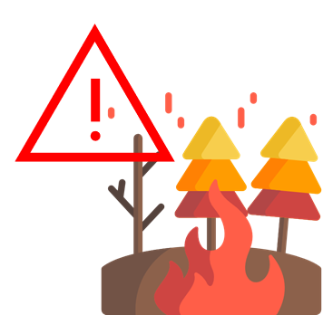

 

    <h1>
        산불 예측 모니터링 시스템
    </h1>

 

    
    

    

# 목차

   

수정중

    

# 기획 의도

<aside> 💡 산불은 한국이나 전 세계를 막론하고 발생하고 있다. 그리고 한번 발생한 산불은 그 규모에 상관없이 경제, 환경, 그리고 인적 손해까지 다양한 방면으로 부정적 영향을 미친다. 따라서 이를 미리 예방하고 예측할 수 있는 시스템이 필요하다. 산림청에서 이와 같은 시스템을 운영 중에 있다.

기존의 시스템에서도 현재 산불위험지수, 행정구역 산불위험등급, 상세 산불위험정보, 산불위험 통계, 과거 자료 검색 등 구체적인 정보를 조회할 수 있는 기능을 제공하고 있다. 하지만, 이 정보가 업데이트되는 간격이 1시간 단위이며, 각 행정구역에 해당하는 정보를 보기 위해서는 드롭다운 메뉴를 통해 일일이 지정해야 하는 불편함이 있었다. 그리고 산불위험 통계의 경우 필터와 함께 단순히 데이터 테이블로만 제공되어 시각적인 효과를 얻기 어려웠으며, 과거 자료의 경우 2017년 자료부터 운용하고 있었다.

그래서 **이전의 불편했거나 아쉬웠던 부분을 보완하고자 이번 프로젝트를 기획**하게 됐다. 한눈에 정보를 파악할 수 있지만 구체적인 정보도 조회가 가능하고, 기존보다 세밀한 시간 간격으로 정보를 제공하고자 한다. 더 많은 기상 지표와 향상된 성능의 화재 발생 확률 지수를 제공하고, 통계에는 시각화를 적용하여 사용자가 해당 통계를 쉽게 파악할 수 있게 한다.

</aside>

# 프로젝트 기간

+ 주제선정 : 2022.06.21~ 2022.06.27
+ WBS 작성 : 2022.06.28
+ 머신러닝 모델 학습용 샘플 데이터셋 구축 : 2022.06.29~ 2022.07.05
+ 전체 데이터 수집 : 2022.07.06~2022.07.11 (학습데이터 수집완료)
+ MySQL에 데이터 적재 : 2022.07.12 ~ 2022.07.18
+ 시각화(EDA) : 2022.07.18~ 2022.07.19
+ Flask로 웹사이트 구축 : 2022.07.20~2022.07.26
+ kafka, airflow 구축: 2022.07.22~2022.07.26
+ 머신러닝 모델링: 2022.07.06~ 2022.07.25

+ 발표자료 작성 : 2022.07.26~2022.07.28
+ 프로젝트 발표: 2022.07.29

   

